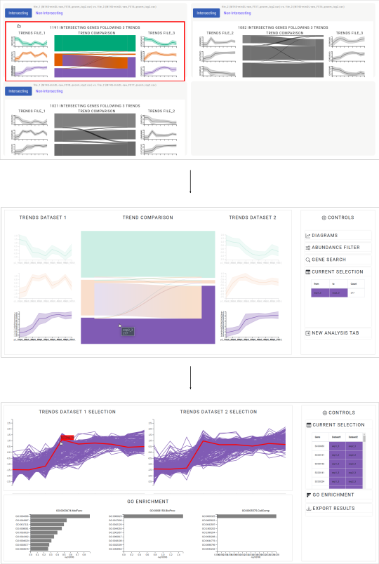

# Welcome to OmicsTIDE!
The ***Omics** **T**rend-comparing **I**nteractive **D**ata **E**xplorer* (OmicsTIDE) is a web-based application to study the concordance and the discordance in the regulatory trends between omics data sets. 

OmicsTIDE combines the benefits of data- and hypothesis-driven analysis by using partitioning algorithms to detect regulatory trends between two data sets on the one hand and by allowing the user to contribute to the analysis based on prior knowledge in an interactive and exploratory manner on the other hand.

The tab-based and dynamic design of OmicsTIDE enables the user to break down large-scale data sets to a manageable and clear number of genes following three major analysis steps (see figure below) while keeping the option to review, refine or remove (previous) analysis steps.

OmicsTIDE is written is based on HTML/JavaScript/CSS using the D3.js and jQuery libraries as well as the Bootstrap framework to enable a clear and dynamic front-end design. For data loading, modification and major data modeling steps, like partitioning and the subsequent trend comparison, OmicsTIDE uses the Flask web framework as back end. 

A detailed description of the tool can be found in the [tutorial](doc/TUTORIAL.md).

<p align="center">
  
</p>

## Installation Guide
The following steps are required to set up the requirements for properly running OmicsTIDE. The installation process includes python libraries for the back-end implementation. Scripts required for the front-end functions are all loaded directly from the web. 

**NOTE: Although it is recommended to work with a virtual environment to avoid package version conflicts, this step can also be skipped if the user is aware of potential conflicts.**

### 1) Basic Requirements
Python, pip and virtualenv version should be >= 3.6.10, >= 20.1.1 and >=20.0.23, respectively.

```console
user@example:~$ python --version
Python 3.6.10
user@example:~$ pip --version
pip 20.1.1
user@example:~$ virtualenv --version
pip 20.0.23
```

### 2) Setting up a Virtual Environment (venv) in Python
cd to the directory where the venv should be located and create the venv
```console
user@example:~$ cd <path/to/venv-parent-dir>
user@example:~/path/to/venv-parent-dir$ virtualenv <your-venv>
```

### 3) Required Python packages
Install required Python packages by referring to the requirements.txt-file.
```console
user@example:~$ . <your-venv>/bin/activate
(<your-venv>) user@example:~$ pip install -r <path/to/OmicsTIDE>/requirements.txt
```

## Running OmicsTIDE
Activate venv and run OmicsTIDE.py which will open the web application in a new browser window. 
```console
user@example:~$ . <your-venv>/bin/activate
(<your-venv>) user@example:~$ python <path/to/omicsTIDE>/OmicsTIDE.py
```
OmicsTIDE requires a stable internet connection to load the front-end libraries and frameworks (D3.js, Bootstrap, jQuery) and to request data from [NCBI](https://www.ncbi.nlm.nih.gov/) and [Panther](http://www.pantherdb.org/). 
