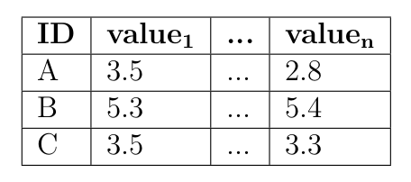
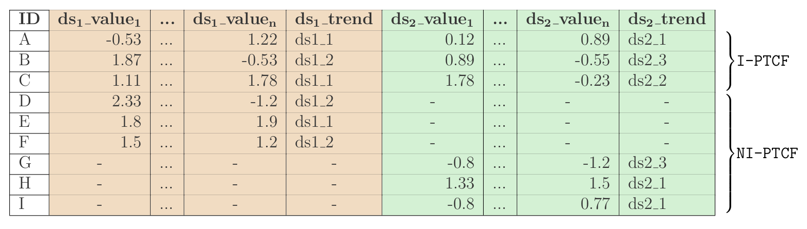

# OmicsTIDE Tutorial
This tutorial gives some basic information

## Background: Data formats

[data formats](DATAFORMATS.md)

### Abundance Data
The fundament of the most algorithms and tools dealing with omics data is a well-structured abundance matrix with non-negative integers or floats with the rows corresponding to the single records (genes) and the columns (value1 to value2) corresponding to the respective n observations (e.g. conditions) of the given record. The record requires an additional column as identifier (ID). 

  

OmicsTIDE uses abundance data as one of its input options. The user should have already adapted the data by adapting the raw data e.g. using quantile-normalization or log2-transformation. 

**NOTE: If the adapted abundance data is directly loaded to OmicsTIDE for the calculation of trend comparison (see input option1) it might be beneficial NOT to remove low-variant genes before loading the abundance data, since the variance filtering of genes can be done in the program interactively.**

**NOTE: If the adapted abundance data is directly loaded to OmicsTIDE for trend comparison (see input option1) it should NOT be z-score-normalized, since this specific normalization is part the data modification in the program.**

### ***P**airwise **T**rend **C**omparison **F**ormat* (PTCF)
The ***P**airwise **T**rend **C**omparison **F**ormat* (PTCF) is the core of OmicsTIDE's data manangement and data modeling procedures. This data format is the result of the loading of abundance data (see option 1). The rows correspond to single records (genes). The columns correspond to the result a pairwise trend comparison of two data sets (ds). Each data set has n columns corresponding to the n observations (e.g. conditions) of the given record. Addtionally, each datasets has a column describing the trend of the given gene. 

Each gene in a PTCF file either corresponds to a gene occurring in both data sets or in one of the two data sets only. The first is referred to as *intersecting*, whereas the latter is referred to as *non-intersecting*. The structure of the PTCF file allows to assign each record to one of the two categories. This distinction is important for the further downstream analysis which treats the two categories separately after splitting them into *intersecting PTCF* (I-PTCF) and *non-intersecting PTCF* (NI-PTCF) sub sets. 

  

**NOTE: If the user decides to create an own PTCF file (see input option 2), it should be considered that a z-score normalization (additionally to other adjustments of the raw abundance data) should be applied .**

## Data Loading (Home Tab)

### Option 1: Loading up to four files for running and exploring pairwise trend comparisons

### Option 2: Loading a PTCF file to explore a pairwise trend comparison

## Choose your pairwise trend comparison (Data Matrix Tab)

### hover trend comparison

### toggle non-intersecting

## Explore pairwise trend comparison (1st Level Analysis Tab)

### First impression

### Change Diagrams

### Apply abundance filters

### find genes

### create subselection

## Explore subselection (2nd Level Analysis Tab)

### Browse subselection
hover genes, go to NCBI

### GO Enrichment

### Export Results

