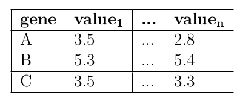
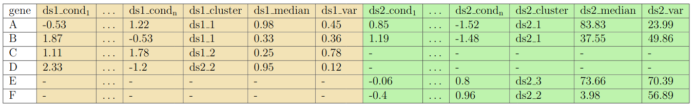

## Background: Data formats

### Abundance Data
The fundament of the most algorithms and tools dealing with omics data is a well-structured abundance matrix with non-negative integers or floats with the rows corresponding to the single records (genes) and the columns (value1 to value2) corresponding to the respective n observations (e.g. conditions) of the given record.

  

OmicsTIDE uses abundance data as one of its input options. The user should have already modified the data by adapting the raw data e.g. using quantile-normalization or log2-transformation. 

**NOTE: attributes**
gene: unique categorical identifier

value: non-negative float

**NOTE: The ID column has to be named "gene".**

**NOTE: If the adapted abundance data is [directly loaded](TUTORIAL.md/###-First-option:-Loading-up-to-four-abundance-files-for-pairwise-trend-comparisons) to OmicsTIDE for the calculation of trend comparison it might be beneficial NOT to remove low-variant genes before loading the abundance data, since the variance filtering of genes can be done in the program interactively).**

**NOTE: If the adapted abundance data is [directly loaded](TUTORIAL.md/###-First-option:-Loading-up-to-four-abundance-files-for-pairwise-trend-comparisons) to OmicsTIDE for trend comparison it should NOT be z-score-normalized, since this specific normalization is part the data modification in the program.**

### ***P**airwise **T**rend **C**omparison **F**ormat* (PTCF)
The ***P**airwise **T**rend **C**omparison **F**ormat* (PTCF) is the core of OmicsTIDE's data manangement and data modeling procedures. This data format is the result of the trend comparison of two [abundance files](TUTORIAL.md/###-First-option:-Loading-up-to-four-abundance-files-for-pairwise-trend-comparisons). The rows correspond to single records (genes). The columns correspond to the result a pairwise trend comparison of two data sets (ds). Each data set has n columns corresponding to the n observations (e.g. conditions) of the given record. Addtionally, each datasets has a column describing the trend of the given gene. For the filtering of the data in OmicsTIDE, additional attributes/column describing the median abundance in percentiles ("ds1_median", "ds2_median") and the variance in percentiles ("ds1_variance", "ds2_variance") per gene and per data has to be provided.

Each gene in a PTCF file either corresponds to a gene occurring in both data sets or in one of the two data sets only. The first is referred to as *intersecting*, whereas the latter is referred to as *non-intersecting*. In the latter case, the corresponding fields are left without value (shown as "-" in the table below). The structure of the PTCF file allows to assign each record to one of the two categories. This distinction is important for the further downstream analysis which treats the two categories separately after splitting them into *intersecting PTCF* (I-PTCF) and *non-intersecting PTCF* (NI-PTCF) sub sets.

A detailed information on the calculation of trend comparisons in I-PTCF and NI-PTCF can be found [here](TRENDCOMPARISON.md)

  

**NOTE: attributes**
gene: unique categorical identifier

ds1_cond(1 to n): float value (z-score)

ds1_cluster: categorical value in the form of ("ds1_" plus an integer from 1 to 6, e.g. "ds1_1")

ds1_median(1 to n): non-negative float value (between 0 and 100)

ds1_var(1 to n): non-negative float value (between 0 and 100)

ds2_cond(1 to n): float value (z-score)

ds2_cluster: categorical value in the form of ("ds2_" plus an integer from 1 to 6, e.g. "ds2_1")

ds2_median(1 to n): non-negative float value (between 0 and 100)

ds2_var(1 to n): non-negative float value (between 0 and 100)

**NOTE: The ID column has to be named "gene".**

**NOTE: The numbers of columns per data set has to be identical.**

**NOTE: If the user decides to create an own [PTCF file](TUTORIAL.md/###-Second-option:-Loading-PTCF-file-to-explore-a-pairwise-trend-comparison)
, it should be considered to perform a z-score normalization (additionally to other adjustments of the raw abundance data), especially if the data ranges differ - e.g. if transcriptome and proteome is compared.**
