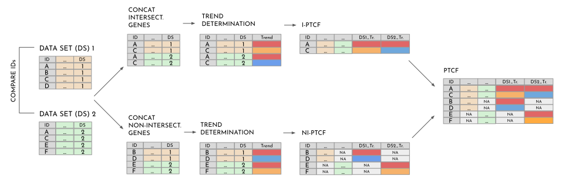

## Trend Comparison
OmicsTIDE performs the comparison of regulatory trends in the following way:

1. Finding (non-)intersecting genes based on the gene ID (Steps 2-4 are done for intersecting and non-intersecting genes separately). 
2. concatenate both data sets
3. determine clustering
4. concatenated format -> wide format (I-PTCF or NI-PTCF)
5. combine I-PTCF and NI-PTCF to PTCF

  

