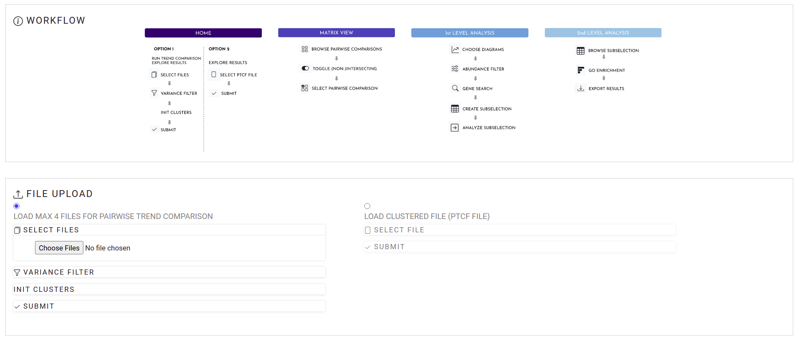
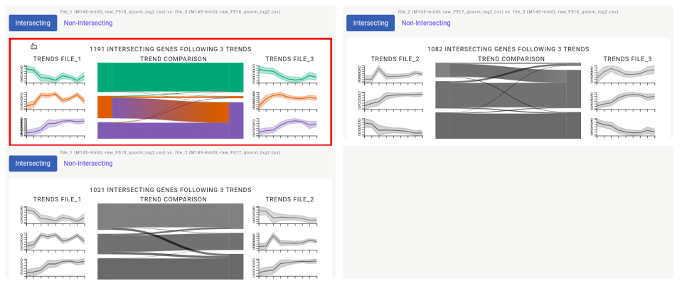
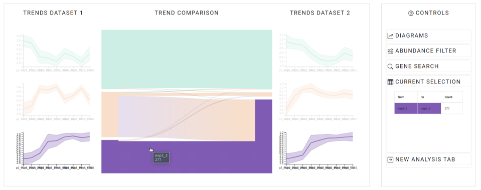
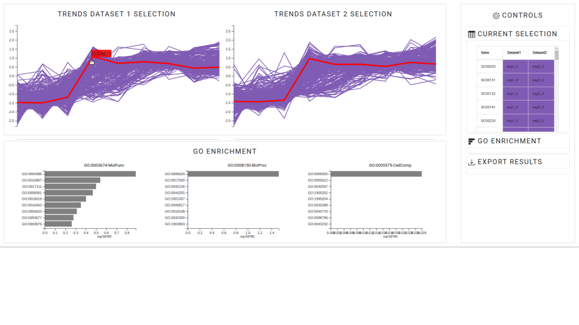

# OmicsTIDE Tutorial
This tutorial will guide the user throught OmicsTIDE from the data loading, over the customized analysis to the final data export.

## Data 
OmicsTIDE uses CSV files following given formats as input. Detailed information on the data formats used by OmicsTIDE [is provided](DATAFORMATS.md). If no further information is required the user can directly run OmicsTIDE.

## Data Loading (Home Tab)
The user has two options for data loading. Either [abundance files](DATAFORMATS.md/###-Abundance-Data) can be loaded to calculate trends first and then explore the corresponding trend comparison or already created trend comparisons in form of a custom [PTCF](DATAFORMATS.md/###-Pairwise-Trend-Comparison-Format-(PTCF)) can directly be loaded and explored.

### Option 1: Loading up to four abundance files for pairwise trend comparisons
The user can select between two and four abundance file for pairwise comparisons. The number of files is restricted to four to ensure a clear overview in the Data Matrix tab with max. four pairwise combinations - i.e. six comparisons. 

If required, the data set can be filtered by adjusting the **range slider** to keep only a given percentile range of genes to e.g. remove low-variant genes. The removal of low-variant genes will speed up the downstream analysis steps, as the number of genes decreases. 

By adjusting the **slider** for the initial clusters, the user can determine the further k-Means clustering step. 

Examples files can be found [here](../static/data/test_data/qnorm_log2) (*Streptomyces coelicolor*).

### Option 2: Loading PTCF file to explore a pairwise trend comparison
The user can directly upload one PTCF file and explore the trend comparisons. 

An example file can be found [here](../static/data/test_data/ptcf) (*Streptomyces coelicolor*).

  

## Choose your pairwise trend comparison (Data Matrix Tab)
Hovering the single comparisons in this tab will put color to the greyscaled graphs to allow the focus on one single pairwise comparison. Per default, the tab corresponding to the trend comparison of the **intersecting genes** is activated. The user can click on the **non-Intersecting** tab to show the trend comparison of the non-intersecting genes, alternatively. 

  

## Explore pairwise trend comparison (1st Level Analysis Tab)

If the pairwise comparison on the intersecting genes was chosen, the user can hover the single nodes and links of the Sankey diagram which will lead to only those diagrams corresponding to the currently hovered genes being highlighted. The diagrams adjacent to the Sankey will be updated with the data corresponding to the node or linked hovered and will be reconstituted if the node or linked is unhovered. For the non-intersecting genes, only adjacent diagrams are shown.

In the controls section on the right, the user can choose three different types of **diagrams** to study the data in more detail. The unfiltered data is studied best using the default activated centroid diagrams the box plots. Depending on the number of genes in the corresponding graph, unfiltered single profile diagrams might be to overloaded.

The user can customize the analysis - and thereby reducing the number of genes - by performing **abundance filtering**. Both, Sankey diagrams and the adjacent diagrams are updated after the handle is released. If the non-intersecting genes are studied, the filtering of the abundance is performed on each data set indivudually. *NOTE* that the abundance filtering step should be done prior to the sub selection in the workflow. Activating the abundance filtering will empty the current selection table (see below).

In the most cases, the user might have already a given gene or a bundle of genes of interest in mind. Hence, the **gene search** section allows to highlight one or more genes by either using a text search, where single gene IDs can be added in a comma-separated fashion or by uploading a text file containing gene IDs separated by line breaks. The highlighting can also be turned off by clicking the button again.

Example text files for known reguatory bundles of genes in *Streptomyces coelicolor* are [provided](../static/test_data/genelist_Streptomyces_coelicolor). The gene lists are based on https://www.nature.com/articles/s41598-020-65087-w.

Once a given trend or pattern of interest was found by filtering and hovering the data, a click on the corresponding node or link will adds the genes corresponding to the clicked element to the **current selection table**. If the non-intersecting genes are studied, diagrams can be directly clicked to add the respective genes to the current selection table.

If an selection of a subset of genes is done, a **new analysis tab** can be opened by clicking the corresponding tab and the **2nd Level analysis** is activated. 

  

## Explore subselection (2nd Level Analysis Tab)
The current selection will appear as profile diagrams. Note, that if the analysis is based on the non-intersecting genes, one diagrams of the two diagrams might be empty, depending on the chosen selection. The genes in the subselection are shown on the top right in a **detailed selection table**. By **hovering** the single profiles, the corresponding genes are highlighted and marked with a tool tip that shows the gene ID. For more detailed information, a click on the currently hovered profile will open the corresponding entry on the **NCBI** home page.

Finding the similarities within a given selection can be done e.g. by performing a **GO enrichment**. Here, the user has to select the species of the current analysis in the drop-down menu, representing all currently [supported genomes (Panther API)](http://pantherdb.org/services/oai/pantherdb/supportedgenomes). The selection of a given species will send a request to Panther. The resulting data of the request will be plotted in horizontal bar charts showing the ten most significant hits for the three main categories, respectively. Hovering the bar charts will show more detailed information on the given GO terms in a tool tip.

The **data export** section allows the user to download a zip-compressed folder containing the two profile diagrams as PDF, the current selection in PTCF as a CSV file and - if chosen - the results of the GO term enrichment ordered by the main category and by the significance of the hits as a CSV file. 

  

