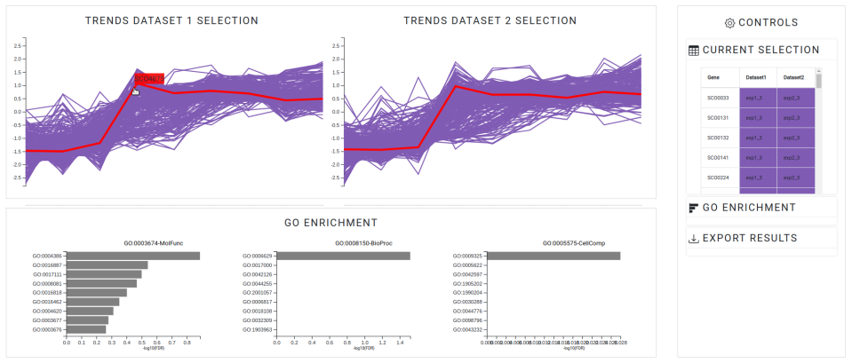

# OmicsTIDE Tutorial
This tutorial gives some basic information

## Background: Data formats
Detailed information on the data formats used in OmicsTIDE can be found [here](DATAFORMATS.md).

## Data Loading (Home Tab)

  

### Option 1: Loading up to four files for running and exploring pairwise trend comparisons
The user can select between two and four [abundance files](DATAFORMATS.md) for pairwise comparisons. The number of files is restricted to four to ensure a clear overview in the Data Matrix tab with max. BINOM(4,2) = 6 comparisons.

If required, the data set can be filtered by adjusting the **range slider** to keep only a given percentile range of genes to e.g. remove low-variant genes. The removal of low-variant genes will speed up the downstream analysis steps, as the number of genes decreases. By adjusting the **slider** for the initial clusters, the user can determine the further k-Means clustering step. 

### Option 2: Loading a PTCF file to explore a pairwise trend comparison
The user can select a previously custome-generated [PTCF](DATAFORMATS.md) file.

## Choose your pairwise trend comparison (Data Matrix Tab)

  

### hover trend comparison

### toggle non-intersecting

## Explore pairwise trend comparison (1st Level Analysis Tab)

  

### First impression

### Change Diagrams

### Apply abundance filters

### find genes

### create subselection

## Explore subselection (2nd Level Analysis Tab)

  

### Browse subselection
hover genes, go to NCBI

### GO Enrichment

### Export Results

